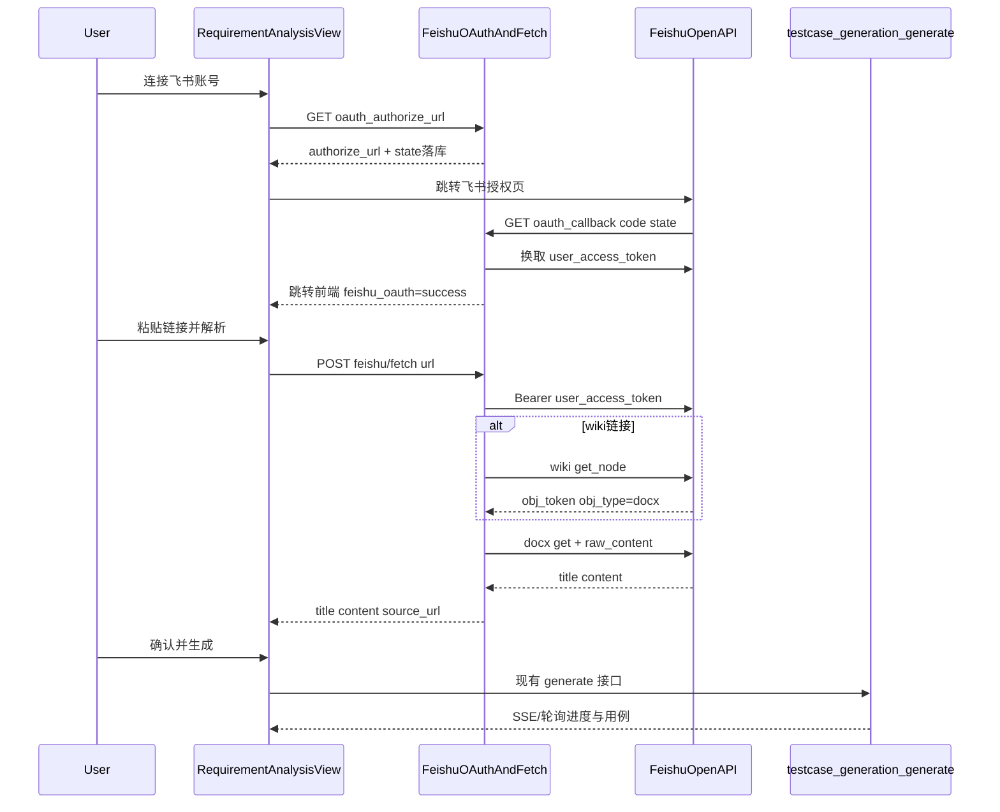

# 飞书文档需求分析技术方案（最新：用户 OAuth）

> 修订说明：初版采用 `tenant_access_token` + 每篇文档「添加文档应用」。现已升级为 **用户 OAuth（`user_access_token`）**，用户授权一次后可读其本人有权限的文档，一般无需逐篇添加文档应用。  
> 运维/使用说明见：[飞书需求文档解析说明.md](./飞书需求文档解析说明.md)。

## 目标与边界

- **目标**：在 `/ai-generation/requirement-analysis` 支持粘贴飞书链接 → 拉取正文 → AI 生成测试用例。
- **鉴权**：**用户 OAuth**（企业自建应用 `app_id` / `app_secret` + 用户授权码 → `user_access_token` / `refresh_token`）。
- **首期文档**：新版文档 `.../docx/{token}`、知识库 `.../wiki/{token}`（Wiki 节点解析为 docx 后取正文）。
- **不做**：旧版 Docs、多维表格、飞书消息通知复用；不以 tenant 身份读取任意企业文档。

## 总体流程



核心原则：**飞书只负责「文本 ingress」**；生成/评审/采纳完全复用现有 `TestCaseGenerationTaskViewSet.generate` → `execute_generation_task` → `AIModelService`。

## 1. 飞书开放平台准备（运维侧）

1. 创建企业自建应用，开通权限：
   - `offline_access`（刷新 `user_access_token`）
   - `docx:document:readonly`（或 `docx:document`）
   - `wiki:wiki:readonly`（或 `wiki:wiki`）
2. 「安全设置 → 重定向 URL」配置与平台 `FEISHU_REDIRECT_URI` **完全一致**。
3. 发布应用；凭证写入平台配置。
4. **不再要求**每篇文档「添加文档应用」。可读范围 = 完成 OAuth 的飞书用户在飞书侧已有的阅读权限。

## 2. 配置设计

在 `config.yaml` / 环境变量增加（优先级仍为 env > yaml）：

```yaml
FEISHU_APP_ID: ""
FEISHU_APP_SECRET: ""
FEISHU_BASE_URL: https://open.feishu.cn
FEISHU_ACCOUNTS_URL: https://accounts.feishu.cn
FEISHU_REDIRECT_URI: http://127.0.0.1:8000/api/requirement-analysis/feishu/oauth_callback/
FEISHU_FRONTEND_REDIRECT: http://localhost:3000/ai-generation/requirement-analysis
FEISHU_OAUTH_SCOPES: "offline_access docx:document:readonly wiki:wiki:readonly"
```

`settings.py` 读取为 `settings.FEISHU_*`。应用密钥仍走配置文件；**用户令牌**存 DB（`FeishuUserAuth`）。

## 3. 后端：飞书客户端与 API

已实现路径：

- `backend/apps/requirement_analysis/feishu_client.py`
- `views.py` → `FeishuViewSet`
- 模型：`FeishuUserAuth`、`FeishuOAuthState`；迁移 `0004` / `0005`

### 3.1 `FeishuClient` 职责

| 方法 | 行为 |
|------|------|
| `build_authorize_url(user_id)` | 生成飞书授权 URL；`state` 写入 `FeishuOAuthState` |
| `exchange_code_for_token(code)` | `POST /open-apis/authen/v2/oauth/token`（authorization_code） |
| `refresh_user_access_token` | 同上接口（refresh_token）；一次性 refresh，落库新 token |
| `get_valid_user_access_token(user)` | 取有效 user token，临近过期自动 refresh |
| `parse_doc_url(url)` | 解析 `feishu.cn` / `larksuite.com` 的 `/docx/`、`/wiki/` |
| `resolve_wiki_to_docx(token)` | wiki get_node → 校验 `obj_type == docx` |
| `get_document_title` / `get_raw_content` | 使用 **user_access_token** 调用 docx API |
| `fetch_requirement(url, user)` | 编排拉取；空正文 / 非 docx Wiki / 无权限明确报错 |
| `get_tenant_access_token` / `test_connection` | 仅运维校验应用凭证，不用于读文档 |

正文后处理：裁剪空白；长度上限约 100k 字符。

### 3.2 API 端点

| 方法 | 路径 | 说明 |
|------|------|------|
| GET | `/api/requirement-analysis/feishu/oauth_status/` | 当前用户是否已连接飞书 |
| GET | `/api/requirement-analysis/feishu/oauth_authorize_url/` | 返回授权 URL |
| GET | `/api/requirement-analysis/feishu/oauth_callback/` | 飞书回调（AllowAny + state 校验），换 token 后跳转前端 |
| POST | `/api/requirement-analysis/feishu/oauth_disconnect/` | 解除绑定 |
| POST | `/api/requirement-analysis/feishu/fetch/` | 用当前用户 OAuth 拉取正文 |
| POST | `/api/requirement-analysis/feishu/test-connection/` | 校验 App 凭证（tenant） |

**不**新建独立 generate-from-feishu 流水线；前端 fetch 后调用已有 `testcase-generation/generate/`。

### 3.3 任务溯源

`TestCaseGenerationTask`：

- `source_type`：`manual` / `upload` / `feishu`
- `source_url`：飞书原文链接

`TestCaseGenerationRequestSerializer` 透传 `project`、`source_type`、`source_url`。

## 4. 前端改造

文件：`RequirementAnalysisView.vue`、`requirement-analysis.js`、i18n。

1. 来源网格新增 **飞书文档** 卡片。
2. **连接飞书账号 / 断开连接**；展示已连接昵称。
3. 未连接时禁用解析；解析后预览标题与正文（可微调）→ 生成。
4. 生成复用 `startGeneration`，传 `source_type: 'feishu'`、`source_url`。
5. 处理回调查询参数 `feishu_oauth=success|denied|error`。
6. 错误映射：`need_oauth` / `need_reauth` / `permission_denied` / 未配置等。

## 5. 错误与权限策略

| 场景 | 处理 |
|------|------|
| 未配 `FEISHU_APP_ID/SECRET` 或 `FEISHU_REDIRECT_URI` | `not_configured` |
| 未连接飞书 | `need_oauth`，引导授权 |
| refresh 失败 / 授权过期 | `need_reauth`，引导重连 |
| 403 读文档 | 提示当前飞书账号无阅读权（分享给该用户） |
| Wiki `obj_type` 非 docx | 明确仅支持挂载为新版文档的 Wiki |
| 网络/飞书 5xx | 可重试提示 |

平台侧不做飞书用户级 ACL；可读性由「该用户在飞书侧是否可读该文档」决定。

## 6. 测试要点

- URL 解析：docx / wiki / query / `larksuite.com`
- 授权 URL 拼装（含 `offline_access`）
- state 落库与一次性消费
- user token 过期自动 refresh
- fetch → generate 全链路
- 前端：连接/断开、回调提示、stream/complete 两种生成模式

## 7. 实施状态

1. ~~配置项 + FeishuClient + fetch / test-connection~~（已完成，后升级为 OAuth）
2. ~~Task 字段迁移 + generate serializer 透传~~
3. ~~前端飞书来源卡片与预览生成~~
4. ~~用户 OAuth（模型 / API / 前端）~~
5. ~~文档：使用说明 + 本技术方案 + README/CLAUDE~~

## 关键文件

- 客户端：`backend/apps/requirement_analysis/feishu_client.py`
- API：`backend/apps/requirement_analysis/views.py` → `FeishuViewSet`
- 生成入口：`TestCaseGenerationTaskViewSet.generate`
- 前端：`frontend/src/views/requirement-analysis/RequirementAnalysisView.vue`
- 使用说明：`docs/飞书需求文档解析说明.md`
